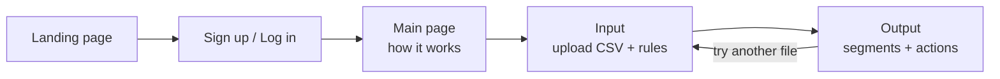

# PRD — AI Marketing Strategist

*Sep 23, 2026 · @Rutwika*

> **Week 1 MVP:** a marketing manager uploads a customer CSV and gets back a segment and a next-best action for every customer, from a live URL, by Friday.

| Field | Value |
|---|---|
| Product | AI Marketing Strategist |
| Author / PM | Rutwika |
| Mentor | Hari Prasad (MyRealProduct program) |
| Status | Draft — Week 1 (MVP) |
| Program week | Week 1 of 4: MVP → RAG → Agents → Reliability |
| Related docs | TRD — AI Marketing Strategist; GitHub repo [link]; live URL [link] |

## One-line solution

For marketing managers struggling to connect messy, multi-source customer data (CDP profiles, revenue, orders, email engagement), this AI web app accepts an uploaded customer data file, uses an LLM to interpret and tie the data together without manual SQL transformations, and returns segmented customer profiles with next-best-action recommendations.

| Question | Answer |
|---|---|
| For a specific user — who experiences the problem? | A marketing manager or strategist who must make data-driven campaign decisions. |
| Help complete one task — what should become easier? | Segmenting customers by their activity (views, purchases, engagement channel) and deciding the next action, without writing SQL or data-engineering pipelines. |
| Using one AI action — what will the model do? | Read a messy uploaded CSV, classify each customer into a segment, and return a structured next-best-action recommendation within company rules. |

## Overview & problem

**Overview:** AI Marketing Strategist is an enterprise web app that turns raw customer activity data into segments and recommended outreach. The LLM acts as the "brain": it interprets whatever columns the file has, so the marketer does not need a fixed schema or a data team.

**Problem:** A customer's activity is scattered across channels — welcome email journeys, SMS, in-store purchases, cart-abandonment emails. To act on it, marketers today must:
- Wait for analysts or engineers to write SQL that joins and cleans multi-source data.
- Apply segmentation logic (e.g. RFM: recency, frequency, monetary) that is not standardized and misses signals such as browsing-only or abandoned carts.
- Translate each segment into a channel and offer by hand, while respecting policy (e.g. never discount more than 20%).

The result is slow, generic campaigns: an at-risk customer who dropped from $100/month to $0 gets the same email as a loyal one.

**What research shows marketers struggle with:**
- Disconnected data silos: the email tool, CRM and ad platforms don't share data, so one customer's journey can't be traced.
- Static segments fail: the same buyer can act budget-conscious one day and premium the next; fixed ICP boxes go stale.
- Over- vs. under-segmentation: too many micro-segments for a small team to serve, or segments so broad the message is generic.
- Transaction-only scoring: classic RFM ignores engagement, discount dependence and relationship length, so high-intent browsers and coupon-only buyers are missed.
- Profit leaks: discounts sent to customers who would have bought anyway, poorly timed messages, and paid ads served to existing buyers.

**Why AI:** The input is messy and varies by company, and the segment → action judgment is contextual. An LLM can interpret arbitrary columns and reason about the right action; a fixed rules engine cannot.

**Why now** (from the whitepapers):
- Customer acquisition cost has risen 222% over eight years, and 67% of brands have shifted spend from acquisition to retention (Sodamola et al., 2026).
- A 5% gain in retention can raise profit by 25–95% (Bain, cited in Sodamola et al., 2026).
- Customers engaged across several channels have about 30% higher lifetime value and shop 1.7× more than single-channel customers (Data on Trend, 2025).
- Personalized emails produce about 6× higher transaction rates than generic ones (Data on Trend, 2025).

*Most of these figures are industry statistics quoted second-hand in the papers, so treat them as directional.*

## Target user & use cases

| Persona | Description | Role in Week 1 |
|---|---|---|
| Marketing manager / strategist (key persona) | Owns campaigns and retention for a brand. Comfortable with CRM and marketing tools, not with SQL. Needs to decide who gets which message, on which channel, with which offer. | Primary user — uploads data, reads segments and actions. |
| Marketing / CRM analyst | Prepares data exports from the CDP, e-commerce and email tools. Today writes the SQL joins. | Secondary — supplies the CSV. |
| Agency or client stakeholder | Reviews recommendations before campaigns launch. | Viewer of the output. |

**Use cases:**
- **Win back at-risk customers:** the manager uploads last quarter's customer export; the app flags customers whose spend dropped and recommends a win-back email with a discount under the 20% cap.
- **Reward loyal customers:** high-frequency, high-value customers are grouped as "Champions" and get an early-access or loyalty offer instead of a discount.
- **Convert browsers and cart abandoners:** customers with views or abandoned carts but no purchase get a cart-reminder email or SMS.
- **Use my own segment definitions:** the manager types in company-specific segments (e.g. "VIP: 5+ orders and $500+ lifetime spend") and the model fits customers to them.

## Objectives & constraints

**Objectives:**
- A marketer goes from raw customer file to segments + next actions in under 2 minutes, with no SQL.
- Every recommendation is explainable in plain language and stays within company business rules.
- Ship a working, deployed MVP by Friday of Week 1 that a friend can open from a link and use.

**Constraints:**
- **Time:** 3 build days (Wed–Fri); scope must be one user, one task, one AI flow.
- **Cost:** CSV capped at ~10–20 rows per upload to keep model-API cost low.
- **Data quality:** no fixed schema — columns and naming vary by company; the model must cope with missing or messy fields.
- **Business rules:** in Week 1 these are a simple static block in the prompt (e.g. max discount 20%), not a knowledge base.
- **Skill level:** frontend is "vibe coded" with Claude Code; no dedicated designer.

## Primary feature & scope

**Primary feature — Segment & Recommend:** upload one customer CSV (optionally add your own segment definitions) → the AI returns, for each customer, a segment, a short plain-language reason, and a next-best action (channel + message + offer) that respects the business rules.

**Features in (Week 1):**

| Feature | Why it matters | Priority |
|---|---|---|
| CSV upload, any columns, 10–20 rows | Meets marketers where their data is; no schema mapping | P0 |
| AI segmentation (Champions, New Potential, At-Risk High-Value, High-Intent Window Shoppers, Bargain Hunters, Hibernating) | Core value: replaces manual SQL + RFM work | P0 |
| Next-best action per customer (channel, message idea, offer) | Turns insight into something a marketer can launch | P0 |
| Static business rules in the prompt (e.g. max 20% discount) | Keeps recommendations within policy | P0 |
| Optional custom segment definitions (free text) | Every company defines segments differently; model falls back to its own if none fit | P1 |
| Results view: table of customers + segment summary counts | Scannable output a manager can act on | P0 |
| Simple login (Supabase auth) and saved past runs | Matches program user journey; lets users revisit results | P1 |

**Segment playbook** (default segments when the user gives none):

| Segment | Typical signals | Next best action |
|---|---|---|
| Champions / VIP Loyalists | Recent, frequent, high spend, long relationship | No discount. Early access, VIP perks, referral ask; use as lookalike seed list |
| New Potential | First purchase recently, low frequency | Welcome/nurture email toward a second purchase; cross-sell adjacent categories; suppress from acquisition ads |
| At-Risk High-Value | Used to buy often and spend a lot, nothing recently, engagement dropping | Priority win-back: personalized SMS or email with a strong offer (within discount cap) |
| High-Intent Window Shoppers | Browsing, email clicks or abandoned cart, no recent purchase | Immediate cart/browse-abandonment reminder with reviews or social proof |
| Bargain Hunters | Frequent, low spend, most orders use a coupon | Target only with clearance/overstock promos; keep off margin-heavy offers |
| Hibernating / Lost | Low recency, frequency and spend | Suppress from paid channels; at most a low-cost re-engagement email |

The model uses RFM (recency, frequency, monetary) and, when the file has the columns, extended signals: length of relationship, engagement (opens, clicks, visits), discount usage and basket size. Users see the segment and a plain-language reason, not the scores.

**Value tier** (second dimension): each customer also gets a High / Medium / Low value tier based on average order value, tenure and retention signals — the two strongest predictors of lifetime value in Sodamola et al. (2026). Segment says what the customer is doing; value tier says how much effort they deserve. Example: an At-Risk High-Value customer gets the strongest win-back offer, an At-Risk Low-Value customer gets a low-cost email only.

**Discount dependence:** measured as discount proportion — total discount ÷ total paid (Antonius & Fitrianah, 2024). It separates Bargain Hunters from loyal customers who happen to use promotions.

**Features out (and why):**

| Feature | Reason |
|---|---|
| Identity resolution / de-duplicating customers across emails, phones, payment methods | Already solved by CDP tools; not the interesting AI problem |
| Multiple files joined together, large datasets (1,000s of rows) | Cost and time; Week 1 takes one pre-exported CSV |
| Company knowledge base (policies, planned campaigns, competitor activity) | Week 2 RAG upgrade |
| Auto-sending emails/SMS or pushing segments to a CDP | Week 3+ agents; needs integrations |
| Enterprise onboarding (Notion, Confluence, Slack connectors) | Handled by a custom onboarding call in real enterprise tools |
| Showing the internal scoring method (RFM/CLTV math) to users | Users get a plain-language reason, not the formula |

## User journey

| Step | What the user sees | What the user does |
|---|---|---|
| 1. Landing page | Headline: "Turn messy customer data into segments and next best actions — no SQL." Short example of an output card. | Clicks Get started |
| 2. Sign up / Log in | Email + password (or magic link) | Creates an account |
| 3. Main page | 3-step guide: 1) Upload your customer CSV, 2) Optionally describe your segments, 3) Get recommendations. Sample CSV to download. | Reads guide or downloads sample |
| 4. Input | File upload (max 20 rows), optional text box "Your segment definitions", business rules shown (e.g. max discount 20%) | Uploads CSV, clicks Analyze |
| 5. Output | Loading state, then segment summary (count per segment) and a table: customer, segment, reason, recommended channel, action, offer | Reviews, downloads results as CSV, or runs another file |

**Error states:** wrong file type, more than 20 rows, empty file, or model failure — each shows a clear message and a retry button.

## Week 1 success criteria

Matches the program finish line: one user, one task, one AI flow — clear input, useful AI output, simple interface, live deployment.

- [ ] A new user can open the live URL, sign up, upload the sample CSV and see results with no help.
- [ ] Every row in a 10–20 row CSV gets a segment, a reason and an action; no rows dropped.
- [ ] Output is valid structured data (consistent fields) and renders cleanly in the UI.
- [ ] 0 recommendations break the business rules (e.g. no discount above 20%) across 3 test files.
- [ ] Works on at least 2 CSVs with different column names (e.g. "total_spend" vs "Revenue").
- [ ] Custom segment definitions are applied when provided.
- [ ] End-to-end response under ~30 seconds for 20 rows.
- [ ] GitHub repo + live URL submitted by Friday night; link sent to a friend.

**Longer-term success metrics (post-MVP):**

| Metric | What it tells us |
|---|---|
| Segment conversion rate | Whether the recommended action lands for that segment |
| Customer acquisition cost (CAC) by channel | Ad waste reduced by suppressing existing buyers |
| Average order value (AOV) | Premium offers to Champions instead of discounts |
| Cost per engagement / margin | Cheaper channels used before paid ones |
| % of recommendations accepted without edits | Marketer trust in the AI output |
| Time from data export to campaign decision | Core time saving vs. manual SQL |

## Roadmap

| Week | Release | What it adds |
|---|---|---|
| 1 | MVP | CSV upload → segments + next-best action, static business rules, live URL |
| 2 | RAG | Company knowledge base (policies, past and planned campaigns, competitor activity) replaces the static rules, e.g. no discount right before a planned Black Friday promo |
| 3 | Agents | Multi-step workflow, e.g. analyze → plan journey → draft email/SMS copy → check against policy; omnichannel message sequencing (cheapest channel first, escalate after ~24 h without response) and ad suppression lists |
| 4 | Reliability | Evals, guardrails, error handling, polish |

## Open issues & decision log

**Open issues:**
- [ ] Confirm the six default segments in the Segment playbook above (based on RFM + LRFM/ERFM research) and their thresholds.
- [ ] Sample CSV: build a realistic synthetic file (no real customer PII) for the demo and landing page.
- [ ] What happens when a company has no documented policies (raised for Week 2)? Fallback: sensible defaults the user can edit.
- [ ] Refine the one-liner and post it to the WhatsApp group for feedback.
- [ ] Discounts for Champions: the playbook says "no discount", but Antonius & Fitrianah (2024) found their top tier used discounts (~16% of spend) and stayed loyal, and suggest exclusive discount programs. Decide: strict no-discount, or allow small exclusive rewards.

**Decisions (Saturday checkpoint, 2026-09-19):**

| Question | Decision |
|---|---|
| Which sub-problem to solve? | Segmentation → recommendation. Identity resolution ruled out (already solved by existing tools). |
| What input? | One CSV, no fixed schema, capped at ~10–20 rows for cost. Optional custom segment definitions. |
| How are business rules applied? | Week 1: static rules block in the prompt. Week 2: RAG over a company knowledge base. |
| Show scoring logic to users? | No — show a plain-language reason only. |
| Enterprise data connectors / onboarding? | Out of scope; handled by a custom onboarding call later. |
| Public or private project? | Rutwika keeps ownership; decision on making it public still open. |

## Sources

*From Rutwika's product research.*

**Segmentation:**
- What is B2C marketing — Emarsys
- Marketing attribution challenges — Klaviyo
- 9 proven customer segmentation strategies — Humblytics
- B2C customer segmentation — Heatseeker
- MDPI Electronics 13(19):3953
- MDPI JTAER 21(5):142
- ACM Digital Library paper

**Next best action:**
- Next best action glossary — CDP.com
- Next best action — Hightouch
- What is next best action — BCG
- Next best action — CleverTap
- Top 8 next best action platforms — LinkedIn

**Whitepapers:**
- Sodamola, A. et al. (2026). *Predicting Customer Lifetime Value to Inform Product Investment Decision.* International Journal of Scientific and Management Research, 9(3), 1–19. doi:10.37502/IJSMR.2026.9301
- Antonius, V. H. & Fitrianah, D. (2024). *Enhancing Customer Segmentation Insights by using RFM + Discount Proportion Model with Clustering Algorithms.* IJACSA, 15(3), 902–911.
- Data on Trend (2025). *Enhancing Omnichannel Personalization at Scale through Advanced Marketing Technologies.* dataontrend.com
