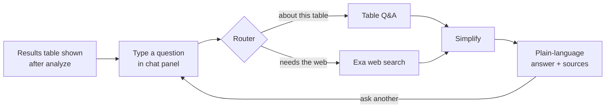

# PRD — AI Marketing Strategist: Results Chatbot

*Oct 8, 2026 · @Rutwika*

> **Chatbot extension:** a marketing manager looking at a results table can ask it a question in plain English — about a specific customer, a segment count, or general marketing practice — and get back one simple, sourced answer without leaving the page.

| Field | Value |
|---|---|
| Product | AI Marketing Strategist — Results Chatbot |
| Author / PM | Rutwika |
| Mentor | Hari Prasad (MyRealProduct program) |
| Status | Draft — planned extension (post Week 2: RAG) |
| Program week | Ad hoc extension, built on the Week 2 RAG foundation |
| Related docs | PRD — AI Marketing Strategist; TRD — AI Marketing Strategist; TRD — AI Marketing Strategist: Results Chatbot; GitHub repo [link]; live URL [link] |

## One-line solution

For a marketing manager who has just analyzed a customer file, this chatbot panel answers questions about that specific results table (counts, lookups, the "why" behind a recommendation) and, when a question needs outside knowledge, searches the web and answers with sources — without the manager leaving the results page or re-reading every row by hand.

| Question | Answer |
|---|---|
| For a specific user — who experiences the problem? | The same marketing manager from the core product, right after they've gotten a results table back. |
| Help complete one task — what should become easier? | Getting a quick, trustworthy answer about the table ("how many Champions?", "why is C002 At-Risk?") or about general marketing practice ("what's a typical win-back discount?") without scanning rows or opening a new tab. |
| Using one AI action — what will the model do? | Classify the question, then either compute/explain an answer from the table's own data, or search the web and answer with citations — and always hand back one short, plain-language reply. |

## Overview & problem

**Overview:** today the results table (`ResultsTable.tsx`) is read-only. A manager with 12–20 rows in front of them can eyeball small counts, but anything beyond a glance — "which customers are getting SMS?", "why did C002 land in At-Risk and not Hibernating?" — means manually scanning every row and its `reason`/`sources` text. And any question that needs outside context (industry benchmarks, what a term means, a sanity-check on an offer) has no path inside the app at all.

**Problem:**
- The table is dense (up to 11 columns after the recent RAG-sourcing and column-hiding work) — "why" and "how many" questions are slow to answer by eye, even at 12–20 rows.
- The existing Pinecone-backed RAG (`backend/rag/`) only grounds the model's *segment reasoning* at analyze-time. It isn't queryable afterward, and it can't answer anything outside that static research corpus (e.g. "is 15% a reasonable win-back offer?").
- There's no way to ask a free-form question and get a direct answer — the manager's only options are to re-read the table or leave the app.

**Why AI:** both branches of this problem need judgment, not a fixed UI control — deciding whether a question is "about this table" or "about the world," computing/explaining an answer from semi-structured row data, and turning a handful of web search snippets into one trustworthy, cited sentence or two.

**Why now:** this builds directly on two things already shipped — the structured `AnalyzeResult` table and the Pinecone RAG/citation pattern (`SourceCitation`, the fail-open `rag_warning` banner) — so the marginal cost of adding a chat layer on top is small, and it closes the most obvious gap users hit once they have a table in front of them: *"okay, now what do I do with this?"*

## Target user & use cases

| Persona | Description | Role |
|---|---|---|
| Marketing manager / strategist (key persona) | Same user as the core product — just analyzed a CSV and is looking at the results table. | Primary user — asks questions in the chat panel. |

**Use cases:**
- **Count/filter a segment:** "How many customers are At-Risk High-Value?" / "List customers getting SMS."
- **Understand a recommendation:** "Why is C002 At-Risk and not Hibernating?" / "Why is C005 getting no discount?"
- **Look up one customer:** "What's the offer for C010?"
- **Ask a general marketing question:** "What's a typical win-back discount for e-commerce?" / "What does RFM mean?"

## Objectives & constraints

**Objectives:**
- Zero hallucinated customer facts — any answer about a specific row must reuse that row's own `reason`/`action`/`offer`/`timing`/`sources`, never invent new analysis.
- Counts and lookups are exactly correct, every time — not "usually right" LLM arithmetic.
- Web-sourced answers always show their source(s); if the web lookup fails, the chat still answers (fail open), with a clear note instead of a crash.
- Ship against the table already on screen — no new database schema this round.

**Constraints:**
- Operates only on the current session's table (≤ `MAX_ROWS` = 20 rows, same cap as `/api/analyze`) — chatting about a previously *saved* run is out of scope this round (see Open issues).
- Single-turn for v1: each question is answered independently; no cross-question memory.
- New external dependency: an Exa account/API key is required for the web-search branch (see the linked TRD's dependency list).

## Primary feature & scope

**Primary feature — Ask about your results:** a chat panel beneath the results table where a manager types a question and gets back one short, plain-language answer, routed automatically to either the table itself or a cited web search.

**Features in:**

| Feature | Why it matters | Priority |
|---|---|---|
| Router: classify each question as "about this table" vs. "needs the web" | The two question types need completely different handling; can't be solved with a keyword rule | P0 |
| Table Q&A: counts, filtered lists, single-customer lookups, "why" explanations | The core, highest-value use case — most questions will be about the table in front of the user | P0 |
| Web-search RAG (Exa): cited answers to general marketing questions | Closes the "now what do I do with this" gap without leaving the app | P0 |
| Simplify step: one consistent, short, plain-language final answer regardless of branch | Keeps the chat feeling like one assistant, not two bolted-together tools | P0 |
| Fail-open web lookups: if Exa errors, say so and still answer if possible | Matches this app's existing `rag_warning` philosophy — degrade visibly, never crash | P0 |
| Citations shown for web answers | A manager should be able to tell "the model's own table" from "something it found online" | P0 |

**Routing playbook** (what decides which branch runs):

| Question shape | Routes to | Example |
|---|---|---|
| References a row, segment, count, or filter on this table | table_qa | "How many Champions?", "Why is C002 At-Risk?", "What's the offer for C010?" |
| General/external marketing knowledge, not derivable from the table | exa_rag | "What's a typical win-back discount for e-commerce?", "What does RFM mean?" |

**Features out (and why):**

| Feature | Reason |
|---|---|
| Multi-turn memory (follow-up questions like "what about them?") | v1 ships single-turn; confirmed with the user as acceptable for now — see Roadmap |
| Chatting about a previously saved run (via `run_id`) | Blocked on a real gap found during planning: `run_results` has no `timing` column, so a fetched historical run silently loses that field; needs a migration first |
| A dedicated reranker model for web search results | Exa's own relevance score + highlights are enough at this question volume; added complexity/cost not justified yet |
| The chatbot taking actions (sending messages, changing recommendations) | Read-only Q&A only — no write access to anything |

## User journey

| Step | What the user sees | What the user does |
|---|---|---|
| 1. Results shown | The results table, as today, after a successful analyze | Scans the table |
| 2. Ask a question | A chat panel below the table with a text input | Types a question, submits |
| 3. Thinking | A short loading state (routing → answering) | Waits (~a few seconds) |
| 4. Answer | A short plain-language reply; web answers show source link(s); a warning note if the web lookup failed | Reads the answer, asks another question, or moves on |

**Error states:** empty question is rejected client-side; a table with more than 20 rows is rejected server-side (same cap as analyze); a failed web lookup still returns an answer (fail open) with a visible note rather than an error; a hard backend/model failure shows a retry option, matching the existing error-banner pattern on the Analyze page.

## Success criteria

- [ ] The chat panel appears under the results table immediately after a successful analyze.
- [ ] An aggregate question ("how many X") returns the exact correct count for the current table, every time.
- [ ] A "why" question's answer only restates that row's own `reason`/`action`/`offer`/`sources` — never new reasoning not present in the table.
- [ ] A general-knowledge question returns an answer with at least one visible web source.
- [ ] Killing the Exa API key still lets the chat answer table questions, and shows a clear warning (not a crash) for web questions.
- [ ] A full answer (routing + branch + simplify) comes back in well under 10 seconds for a 20-row table.
- [ ] The endpoint requires login, same as every other `/api/*` route.

## Roadmap

| Stage | Release | What it adds |
|---|---|---|
| This round | Results Chatbot v1 | Router + table_qa + exa_rag + simplify, single-turn, operates on the current in-memory table only |
| Next | Historical-run chat | Add the missing `timing` column to `run_results`, have `/api/analyze` return the new run's id, let the chat take a `run_id` instead of (or alongside) an inline table |
| Later | Multi-turn memory | Thread prior Q&A through the graph state so follow-up questions resolve |
| Later, if needed | Reranking | Add a dedicated reranker to the web-search branch if answer quality needs it beyond Exa's native relevance score |

## Open issues & decision log

**Open issues:**
- [ ] `run_results` is missing a `timing` column — blocks historical-run chat until migrated (also affects any other future feature reading saved runs).
- [ ] Decide, when a table question could *also* be read as general knowledge (e.g. "is this customer's offer reasonable?"), whether the router should ever blend both branches — v1 decision: no, the router picks exactly one branch per question.
- [ ] Confirm Exa pricing/quota is acceptable at expected usage before enabling this in production.

**Decisions (this planning round, 2026-10-08):**

| Question | Decision |
|---|---|
| Multi-turn memory for v1? | No — single-turn only; each question answered independently against the table. |
| Where do PRD/TRD for this feature live? | New dedicated files (`PRD_chatbot.md`/`TRD_chatbot.md`), not edits to the Week 1 docs. |
| Does a web answer ever override the table's own `reason`? | No — table questions always route to `table_qa`, which only ever restates the table's existing fields. |
| Chat over historical saved runs in v1? | No — inline current-table only, deferred until the `timing` column gap is fixed. |

## Sources

- Exa API documentation (neural search + content highlights).
- LangGraph documentation (graph/state/conditional-edge patterns).
- Rutwika's own `02-advanced-rag` and `03-advanced-retrieval` training notebooks (private, from the MyRealProduct program) — used as pattern inspiration for the web-search node's query-rewrite and snippet-trimming steps, not copied directly.
- This project's own `backend/rag/` module and `docs/TRD.md` — the existing fail-open / citation patterns this feature extends.
