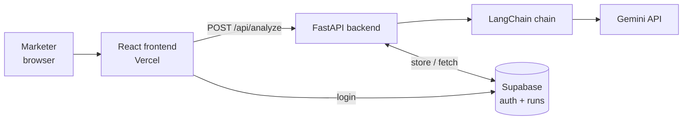
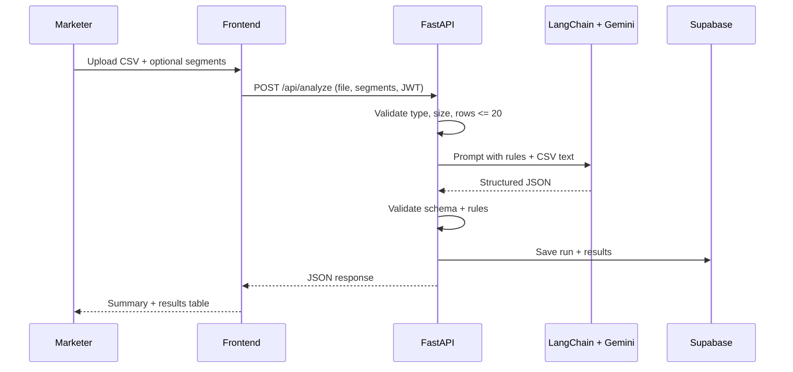

# TRD — AI Marketing Strategist

*Sep 23, 2026 · @Rutwika*

> **Week 1 build:** a React frontend on Vercel calls a FastAPI backend, which parses the uploaded CSV and sends it through one LangChain + Gemini call that returns structured segments and recommendations; Supabase handles login and saved runs.

| Field | Value |
|---|---|
| System | AI Marketing Strategist — Week 1 MVP |
| Author | Rutwika |
| Status | Draft |
| Linked PRD | PRD — AI Marketing Strategist |
| Build tool | Claude Code (reads this TRD + the PRD as starting context) |
| Repo / live URL | github.com/Rutwika/-AI-Marketing-Strategist / [Vercel link] |

## Frontend & backend



| Layer | Choice | Responsibility |
|---|---|---|
| Frontend | React (Vite) + Tailwind, built with Claude Code | Landing, login, main page, upload form, results table |
| Backend | Python FastAPI | Validate upload, parse CSV (pandas), call the AI chain, validate output, return JSON |
| AI workflow | LangChain (langchain-google-genai) | Prompt template, model call, structured-output parsing |
| Model | Google Gemini (Flash-tier model for speed and cost) | Segmentation + recommendation |
| Database / auth | Supabase (Postgres + Auth) | User accounts, saved runs and results |
| Hosting | Render (backend, chosen over Vercel Python functions to avoid serverless timeout risk); Vercel (frontend) | Live URL, auto-deploy from GitHub |
| Code | GitHub — github.com/Rutwika/-AI-Marketing-Strategist | Version control, deployment source |

**Repo layout:**

```
-AI-Marketing-Strategist/
  docs/PRD.md, docs/TRD.md
  frontend/        # React app
  backend/
    main.py        # FastAPI app + routes
    chain.py       # LangChain prompt + Gemini call
    schemas.py     # Pydantic models
    rules.py       # static business rules
  sample_data/customers_sample.csv
```

## AI model & prompt

One model call per upload. The model gets the CSV rows, the business rules and optional custom segments, and must return JSON matching a Pydantic schema (LangChain `with_structured_output`). Temperature low (~0.2) for consistent segments.

**Prompt structure:**

```
SYSTEM
You are a senior B2C marketing strategist. You receive customer data exported
from different tools (CDP, orders, revenue, email engagement). Column names
and formats vary - infer what each column means.

SCORING (internal - never show scores to the user)
- Score each customer 1-5 on Recency, Frequency, Monetary (RFM),
  relative to the other customers in the file.
- If the columns exist, also consider: Length of relationship (first
  purchase/signup date), Engagement (opens, clicks, visits, app opens),
  Discount proportion (total discount / total paid, or % of
  orders with a coupon), Basket depth (items/categories
  per order).

Tasks for EVERY customer row:
1. Assign exactly one segment.
   - If custom segments are provided, use them. If a customer fits none,
     assign the closest default segment and set fits_custom_segment=false.
   - Default segments:
     Champions (high R, F, M, long relationship)
     New Potential (high R, low F; recent first purchase)
     At-Risk High-Value (low R, high F and M, engagement dropping)
     High-Intent Window Shoppers (no recent purchase, high engagement or
       abandoned cart)
     Bargain Hunters (high F, low M, high discount usage)
     Hibernating (low R, F, M)
2. Assign a value tier: High, Medium or Low. Weight average order value
   and tenure most, then retention signals (recency, engagement).
3. Give a one-sentence reason in plain business language.
4. Recommend the next best action (channel, action, offer, timing) using
   the segment playbook and business rules below. Scale offer strength
   and channel cost to the value tier.

SEGMENT PLAYBOOK
- Champions: no discount; early access, VIP perks, referral ask.
- New Potential: welcome/nurture email, cross-sell adjacent category.
- At-Risk High-Value: priority win-back via SMS or personal email,
  strongest allowed offer.
- High-Intent Window Shoppers: cart/browse reminder within 24 h,
  reviews or social proof.
- Bargain Hunters: clearance/overstock promos only.
- Hibernating: one low-cost re-engagement email; no paid channels.

BUSINESS RULES (never break these)
{business_rules}

CUSTOM SEGMENTS (optional)
{custom_segments}

CUSTOMER DATA (CSV)
{csv_text}

If data for a customer is missing or unclear, say so in the reason and
lower the confidence.
```

**Week 1 business rules (`rules.py`):**
- Never offer a discount above 20%.
- Never discount Champions; use perks or early access instead.
- Channel order: use the cheapest channel that fits (email or push) before SMS; paid retargeting only as a last resort, and never for Hibernating customers.
- Allowed channels: email, SMS, push/in-app, paid social, none.
- Maximum one recommended action per customer.
- **Guardrails:** backend re-checks that no Champion gets a discount, every `discount_pct` ≤ 20 and that every input row has exactly one result; if the check fails, retry once, then return an error to the UI.

## Data flow



1. User uploads a `.csv` and optionally types segment definitions.
2. Frontend sends `multipart/form-data` with the Supabase auth token.
3. Backend checks file type, size (< 1 MB), 1–20 data rows; parses with pandas and re-serializes as clean CSV text.
4. LangChain fills the prompt and calls Gemini with the output schema.
5. Backend validates the JSON (every row covered, rules respected); retries once on failure.
6. Run and results saved to Supabase; response returned to the UI, which renders the summary and table.

## Inputs & outputs

**Input:**

| Field | Type | Rules |
|---|---|---|
| file | CSV | Required; UTF-8; < 1 MB; header row + 1–20 data rows; any columns (must include some customer identifier) |
| custom_segments | text | Optional; max ~1,000 characters, e.g. "VIP: 5+ orders and $500+ spend" |

**Sample input CSV** (synthetic):

```
customer_id,email,first_purchase_date,last_purchase_date,orders_12m,total_spend,coupon_orders_pct,email_opens_30d,site_visits_30d,cart_abandoned,channel_pref
C001,ana@example.com,2023-02-11,2026-09-10,14,1820,5,9,12,no,email
C002,raj@example.com,2024-11-02,2026-03-15,9,1310,10,0,0,no,sms
C003,lee@example.com,,,0,0,0,4,7,yes,email
C004,sam@example.com,2025-06-20,2026-08-30,11,240,90,3,5,no,email
```

**Output schema (Pydantic → JSON):**

```json
{
  "summary": { "total_customers": 4, "segments": { "Champions": 1, "At-Risk High-Value": 1, "High-Intent Window Shoppers": 1, "Bargain Hunters": 1 } },
  "results": [
    {
      "customer_id": "C002",
      "segment": "At-Risk High-Value",
      "value_tier": "High",
      "fits_custom_segment": true,
      "reason": "Bought regularly until March, no purchases or email opens since.",
      "channel": "sms",
      "action": "Win-back message with a limited-time offer",
      "offer": "15% off next order",
      "discount_pct": 15,
      "timing": "Within 7 days",
      "confidence": "medium"
    }
  ]
}
```

**API endpoints:**

| Method | Endpoint | Purpose | Auth |
|---|---|---|---|
| GET | /api/health | Health check | None |
| POST | /api/analyze | Upload CSV (+ segments) → results JSON | Supabase JWT |
| GET | /api/runs | List the user's past runs | Supabase JWT |
| GET | /api/runs/{id} | Fetch one saved run | Supabase JWT |

**Errors:** 400 bad file / too many rows, 401 not logged in, 502 model failure after retry.

## Data storage & security

| Table | Key columns | Notes |
|---|---|---|
| auth.users | managed by Supabase Auth | Email login |
| runs | id, user_id, file_name, row_count, custom_segments, created_at | Row-level security: user sees only own runs |
| run_results | id, run_id, customer_id, segment, value_tier, reason, channel, action, offer, discount_pct, confidence | Stores output only, not the raw CSV |

- API keys (Gemini, Supabase service key) live in environment variables, never in the repo or frontend.
- Raw CSV is processed in memory and not stored; demo uses synthetic data only.
- CORS limited to the frontend domain; file size and row limits enforced server-side.

## Deployment plan

| Day | Goal | Tasks |
|---|---|---|
| Wed, Sep 23 | First working flow | Create repo + FastAPI project; add chain.py with Gemini key; run the sample CSV end to end and get valid JSON |
| Thu, Sep 24 | Complete product flow | Build React pages with Claude Code (landing, login, main, input, output); connect to /api/analyze; add Supabase auth + runs tables; test the full journey |
| Fri, Sep 25 | Deploy + submit | Break-and-fix testing; deploy backend and frontend; set env vars; smoke-test live URL; submit GitHub repo + URL; ping Hari on WhatsApp |

**Environment variables:** `GOOGLE_API_KEY`, `SUPABASE_URL`, `SUPABASE_ANON_KEY` (frontend), `SUPABASE_SERVICE_KEY` (backend only), `FRONTEND_ORIGIN`.

**Pipeline:** push to `main` on GitHub → Render/Vercel auto-deploy.

## Testing, risks & next steps

**Testing:**
- 3 synthetic CSVs with different column names and one messy file (blank cells, mixed date formats).
- Unit tests for CSV validation and the rules check (discount_pct ≤ 20, one result per row).
- Manual end-to-end test on the live URL from a fresh account.

| Risk | Mitigation |
|---|---|
| Model returns malformed JSON or skips rows | Structured output + backend validation + one retry |
| Inconsistent segments between runs | Low temperature, fixed default segment list, clear definitions in prompt |
| Slow response for 20 rows | Flash-tier model, single call, loading state in UI |
| API cost | 20-row cap, one call per upload |
| Serverless timeout on backend host | Host FastAPI on Render (decided — avoids Vercel function timeout) |

**Future upgrades:** Week 2 adds a RAG retriever (Supabase pgvector) over company policies, campaign calendar and competitor notes, replacing rules.py. Week 3 splits the flow into agents (analyst → strategist → copywriter → policy checker) and adds omnichannel message sequencing (email/push first, escalate to SMS after ~24 h, paid retargeting last) plus suppression lists that keep existing buyers out of acquisition ads.

**Scoring upgrades (from the whitepapers):**

| When | Upgrade | Why |
|---|---|---|
| Week 4 (reliability) | Hybrid scoring: LLM call 1 maps messy columns to standard fields; pandas computes RFM, discount proportion, AOV and tenure; LLM call 2 segments and recommends | LLMs are weak at arithmetic; computed scores make segments repeatable and testable |
| Beyond MVP, larger files | Clustering (K-means / mini-batch K-means on normalized RFM + DP) to suggest data-driven segments | Antonius & Fitrianah (2024): 4 clusters, silhouette ~0.50; needs hundreds of rows, not 20 |
| Beyond MVP, with history | Predictive CLV (BG/NBD, or Random Forest on AOV, tenure, retention) instead of a descriptive tier | Sodamola et al. (2026): RFM describes the past; AOV and tenure were the top CLV predictors |

**Open questions (resolved at the 2026-09-24 planning session):**
- Host FastAPI on Vercel Python functions or on Render? → **Render.**
- Is Supabase login required for Week 1, or can the demo run without an account to reduce friction? → **Included in Week 1.**
