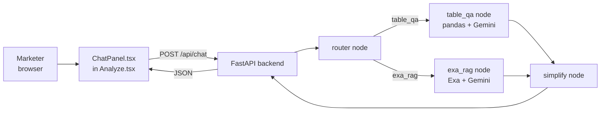

# TRD — AI Marketing Strategist: Results Chatbot

*Oct 8, 2026 · @Rutwika*

> **Build summary:** a new `POST /api/chat` endpoint runs a LangGraph graph — router → (table_qa | exa_rag) → simplify — against the `AnalyzeResult` the frontend already holds in memory, and a new chat panel renders it next to the results table. No new database tables.

| Field | Value |
|---|---|
| System | AI Marketing Strategist — Results Chatbot |
| Author | Rutwika |
| Status | Draft |
| Linked PRD | PRD — AI Marketing Strategist: Results Chatbot |
| Build tool | Claude Code (reads this TRD + its PRD as starting context) |
| Repo / live URL | github.com/Rutwika/-AI-Marketing-Strategist / roma-backend-6iqs.onrender.com (API) / ai-marketing-strategist.vercel.app (frontend) |

## Frontend & backend



| Layer | Choice | Responsibility |
|---|---|---|
| Frontend | React component `ChatPanel.tsx`, embedded in `Analyze.tsx` | Question input, message list, loading state, citation display |
| Backend orchestration | LangGraph (`StateGraph`) | router → table_qa/exa_rag → simplify, with a shared `ChatState` |
| Table Q&A | pandas over `AnalyzeResult.results` + Gemini for intent/explanation | Deterministic counts/lookups; grounded "why" answers |
| Web search RAG | Exa (`exa-py`, direct SDK) + Gemini | Neural web search, content highlights, grounded answer + citations |
| Model | Google Gemini (same flash-tier model as `chain.py`) | Routing classification, query rewrite, answer generation, simplification |
| Hosting | Same Render (backend) / Vercel (frontend) deployment as the core product | No new services |

**Repo layout (additions in bold):**

```
-AI-Marketing-Strategist/
  docs/PRD.md, docs/TRD.md
  docs/PRD_chatbot.md, docs/TRD_chatbot.md      ** new **
  frontend/
    src/components/ResultsTable.tsx
    src/components/ChatPanel.tsx                ** new **
    src/pages/Analyze.tsx                        (renders ChatPanel next to ResultsTable)
    src/lib/api.ts                               (+ askChat)
    src/lib/types.ts                             (+ ChatRequest/ChatResponse)
  backend/
    main.py            # + POST /api/chat
    chain.py
    schemas.py          # + ChatRequest, ChatResponse
    rag/                 # existing Pinecone research-grounding RAG (unrelated, not reused here)
    chatbot/              ** new package **
      config.py          # EXA_API_KEY, EXA_NUM_RESULTS, EXA_TOP_K, CHAT_GEMINI_MODEL
      exa_client.py       # @lru_cache get_exa_client()
      state.py            # ChatState TypedDict
      router.py           # RouteDecision schema + classify_route()
      table_qa.py          # TableQueryPlan schema + pandas/LLM logic
      exa_rag.py           # query rewrite + Exa search + trim + grounded answer
      simplify.py          # final-answer composer
      graph.py             # builds/compiles the StateGraph; exposes run_chat()
```

## AI model & prompt

Up to 3-4 small Gemini calls per chat turn (router, table_qa's intent classifier and/or explanatory answer, or exa_rag's query rewrite and answer generation, then simplify) — all on the same flash-tier model already used by `chain.py`, at low temperature (0–0.2) for consistent routing/answers.

**Node 1 — `router`** (structured output, reuses `ChatGoogleGenerativeAI.with_structured_output`, same pattern as `chain.py`):

```
SYSTEM
You classify a user's question about a customer-segmentation results table.
Return exactly one route:
- "table_qa"  - the question is about THIS table: a specific customer, a
  segment, a count, a filter, or "why" a row got its recommendation.
- "exa_rag"   - the question needs outside/general marketing knowledge not
  answerable from the table (definitions, industry benchmarks, best practice).

Examples:
"How many Champions are there?" -> table_qa
"Why is C002 At-Risk and not Hibernating?" -> table_qa
"What's a typical win-back discount for e-commerce?" -> exa_rag
"What does RFM mean?" -> exa_rag

TABLE COLUMNS: {column_names}
QUESTION: {question}
```

**Node 2 — `table_qa`** (internal-only schema `TableQueryPlan`, like `chain.py`'s `_LLMCustomerResult`):

```
SYSTEM
Classify this question about the table into exactly one kind, and extract
any filters mentioned. Never invent customer facts - only identify what the
user is asking for.

kind: "aggregate" (counts/lists across many rows) | "lookup" (one customer's
  fields) | "explanatory" (why a row got its recommendation)
segment_filter / value_tier_filter / channel_filter: optional
customer_ids: list of ids mentioned, if any

QUESTION: {question}
```
- `aggregate`/`lookup` -> answered by filtering a `pandas.DataFrame` built from `table.results` in plain Python - **no LLM call produces the number/list**, so it's deterministic and unit-testable without mocking an LLM.
- `explanatory` -> the matched row(s)' existing `reason`/`action`/`offer`/`timing`/`sources` are passed to one more small Gemini call whose system prompt explicitly says: *"Answer using ONLY the fields given below. Do not invent new RFM reasoning or new facts about this customer."*

**Node 3 — `exa_rag`:**
1. Query rewrite (Gemini): turns the raw question into a focused web-search query.
2. `exa.search_and_contents(rewritten_query, num_results=EXA_NUM_RESULTS, type="neural", highlights={"num_sentences": 3, "highlights_per_url": 2})`.
3. Trim to `EXA_TOP_K` results by Exa's own relevance score (already sorted; no separate reranker).
4. Grounded answer (Gemini): given the rewritten query + trimmed highlights (each tagged title/URL), produce an answer and populate `citations` (reusing `schemas.SourceCitation` — `document` = `"{title} ({url})"`, `excerpt` = the Exa highlight).

**Node 4 — `simplify`** (always runs, regardless of branch):
```
SYSTEM
Rewrite the answer below into 2-4 short, plain-language sentences for a
marketing manager. Do not add new facts. If a warning is present, keep it
and state it plainly - do not minimize or hide it.
```

**Fail-open, per node** (matches `backend/rag/retrieval.py`'s documented posture): any Gemini/Exa call inside `router`/`table_qa`/`exa_rag` is wrapped in try/except; on failure the node sets `warning` and a plain fallback `raw_answer`, and the graph still reaches `simplify` — never a crash mid-graph. `/api/chat` returns HTTP 200 with `warning` populated in that case, the same shape as `AnalyzeResult.rag_warning` today. A hard failure before the graph can even start (e.g. missing `GOOGLE_API_KEY`) still raises loudly at startup/config time, matching `rag/pinecone_client.py`'s `get_index()` precedent.

## Data flow

```mermaid
sequenceDiagram
  participant U as Marketer
  participant P as ChatPanel
  participant B as FastAPI
  participant R as router
  participant T as table_qa
  participant X as exa_rag
  participant S as simplify
  U->>P: Type question, submit
  P->>B: POST /api/chat (question, table, JWT)
  B->>B: get_user_id(authorization); validate question + row count
  B->>R: classify_route(question)
  alt route = table_qa
    R->>T: question, table
    T->>T: pandas filter (aggregate/lookup) or Gemini (explanatory)
  else route = exa_rag
    R->>X: question
    X->>X: rewrite -> Exa search -> trim -> grounded answer
  end
  T-->>S: raw_answer, citations
  X-->>S: raw_answer, citations
  S->>S: rewrite into final_answer
  S-->>B: ChatResponse
  B-->>P: JSON response
  P-->>U: Answer + citations (+ warning if any)
```

1. Marketer types a question in `ChatPanel.tsx`; the panel already holds the current `AnalyzeResult` from `Analyze.tsx`'s state.
2. Frontend POSTs `{question, table}` + the Supabase JWT to `/api/chat`.
3. Backend authenticates (`get_user_id`, same pattern as every other route) and validates (`question` non-empty, `table.results` ≤ `MAX_ROWS`).
4. `run_chat(question, table)` compiles/invokes the LangGraph graph: `router` picks a branch, that branch produces a `raw_answer` (+ `citations`/`warning` if any), `simplify` always runs last.
5. Backend returns `ChatResponse`; the frontend appends it to the panel's in-memory message list (no persistence).

## Inputs & outputs

**Input (`ChatRequest`):**

| Field | Type | Rules |
|---|---|---|
| question | string | Required; 1–500 characters |
| table | `AnalyzeResult` | Required; `results` ≤ `MAX_ROWS` (20, same cap as `/api/analyze`) |

**Sample request:**

```json
{
  "question": "Why is C002 At-Risk High-Value?",
  "table": {
    "summary": { "total_customers": 2, "segments": { "At-Risk High-Value": 1, "Champions": 1 } },
    "results": [
      {
        "customer_id": "C002",
        "segment": "At-Risk High-Value",
        "value_tier": "High",
        "fits_custom_segment": true,
        "reason": "Bought regularly until March, no purchases or email opens since.",
        "channel": "sms",
        "action": "Win-back message with a limited-time offer",
        "offer": "15% off next order",
        "discount_pct": 15,
        "timing": "Within 7 days",
        "confidence": "medium",
        "sources": []
      }
    ]
  }
}
```

**Output schema (`ChatResponse`):**

```json
{
  "answer": "C002 is At-Risk High-Value because they used to order regularly but stopped buying and opening emails after March - that drop in recency and engagement, combined with their past high spend, is what separates this segment from Hibernating.",
  "route": "table_qa",
  "warning": null,
  "citations": []
}
```

**Sample `exa_rag` response (web question):**

```json
{
  "answer": "A typical win-back discount for e-commerce is in the 10-20% range, often time-limited to create urgency.",
  "route": "exa_rag",
  "warning": null,
  "citations": [
    { "document": "Win-back email best practices (klaviyo.com)", "excerpt": "Most win-back offers fall between 10% and 20% off..." }
  ]
}
```

**API endpoints:**

| Method | Endpoint | Purpose | Auth |
|---|---|---|---|
| POST | /api/chat | Ask a question about the given table -> routed answer | Supabase JWT |

**Errors:** 400 empty question or table over 20 rows; 401 not logged in; a failed Exa/Gemini call inside a node is fail-open (200 + `warning`, not an error status) — only a hard crash before/outside the graph returns 502, matching `/api/analyze`'s guardrail-then-502 pattern.

## Data storage & security

No new tables. The table is never persisted server-side by this feature — it's received, used for one graph run, and discarded. `EXA_API_KEY` lives in environment variables only, never in the repo or frontend, following the existing `GOOGLE_API_KEY`/`PINECONE_API_KEY` pattern.

**Why historical-run chat is out of scope this round:** `run_results` (the Supabase table behind `GET /api/runs/{id}`) has no `timing` column — `main.py` silently defaults it to `""` when reconstructing a saved run. A `run_id`-based chat would inherit that data loss. Fixing it needs a migration (`alter table run_results add column timing text not null default ''`, backfilled or accepted as empty for old rows) before historical-run chat can be built - tracked as a roadmap item in the linked PRD, not solved here.

## Deployment plan

| Stage | Goal | Tasks |
|---|---|---|
| Build | New backend package + endpoint | Add `backend/chatbot/`, `ChatRequest`/`ChatResponse` in `schemas.py`, `POST /api/chat` in `main.py`; add `langgraph`/`exa-py` to `requirements.txt` |
| Build | Frontend panel | Add `ChatPanel.tsx`, `askChat()` in `lib/api.ts`, new interfaces in `lib/types.ts`; render under `ResultsTable` in `Analyze.tsx` |
| Deploy | Wire up Exa | Add `EXA_API_KEY` (+ `EXA_NUM_RESULTS`, `EXA_TOP_K`, `CHAT_GEMINI_MODEL`) to `backend/.env.example` and as a Render secret, same pattern as `PINECONE_API_KEY` |
| Deploy | Ship | Push to `main`; Render/Vercel auto-deploy (same pipeline as the core product) |

**Environment variables (new):** `EXA_API_KEY` (secret), `EXA_NUM_RESULTS` (default 8), `EXA_TOP_K` (default 3), `CHAT_GEMINI_MODEL` (default `gemini-3.5-flash-lite`, reuses `GOOGLE_API_KEY`).

**Pipeline:** unchanged — push to `main` on GitHub → Render (backend) / Vercel (frontend) auto-deploy.

## Testing, risks & next steps

**Testing:**
- `table_qa`'s pandas aggregate/lookup logic: plain pytest, no LLM mocking needed (deterministic) — e.g. "2 Champions, 1 At-Risk" fixture table -> assert exact counts/lists.
- `exa_rag`: unit test with a mocked Exa client (fixed search results) to verify trimming/citation shape without a live API call or cost.
- `router`: a small fixed set of example questions with expected routes, run against the real classifier periodically (not a hard CI gate, since LLM classification isn't 100% deterministic).
- Manual end-to-end: one aggregate, one lookup, one explanatory, one web question, against the live app.

| Risk | Mitigation |
|---|---|
| Router misclassifies a question | Clear few-shot examples in the router prompt; `table_qa` is the safer default for ambiguous questions since it can't hallucinate new customer facts |
| Exa API outage or quota exhausted | Fail open — `exa_rag` returns a warning + honest fallback instead of crashing the chat turn |
| "Why" answers invent new reasoning | Explanatory prompt is explicitly restricted to the row's existing fields only (see AI model & prompt) |
| Per-question LLM call cost | Up to 3-4 small flash-tier calls per turn; acceptable at this app's existing ≤20-row, low-traffic scale |
| Users expect chat over past/saved runs | Out of scope this round; documented gap (`timing` column) and roadmap item in the linked PRD |

**Next steps:** add the `timing` column migration + have `/api/analyze` return the new run's id (unlocks historical-run chat); add multi-turn memory (thread prior Q&A through `ChatState`); add a dedicated reranker to `exa_rag` only if answer quality needs it beyond Exa's native relevance score.
